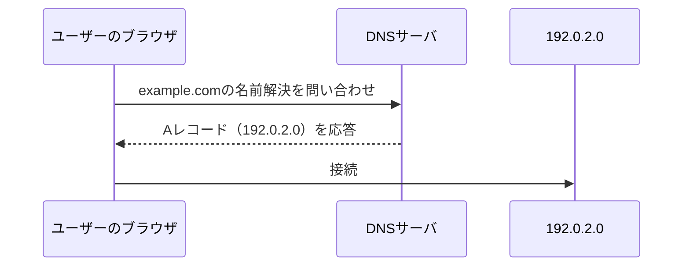
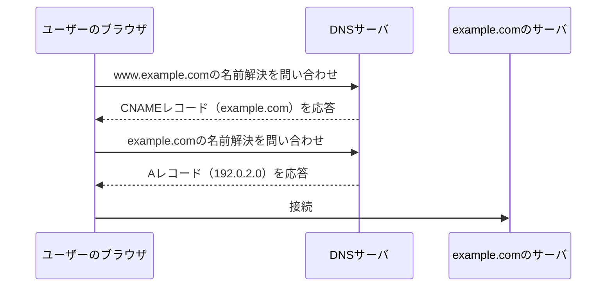
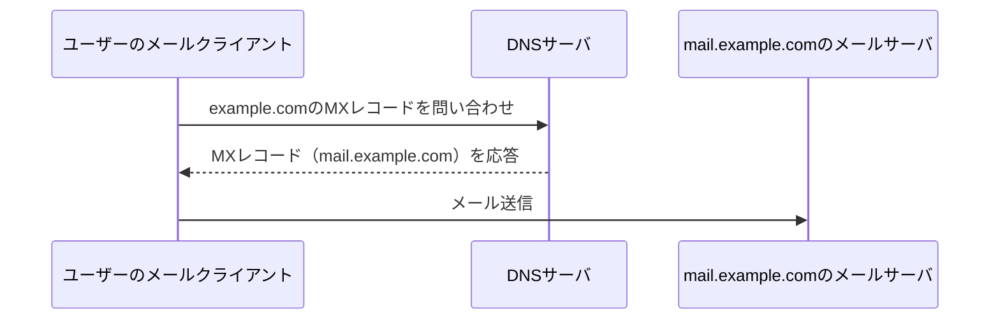
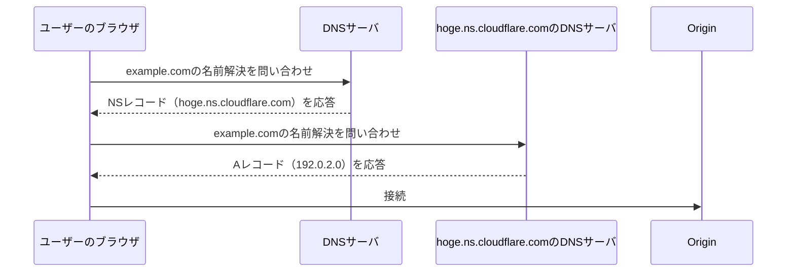
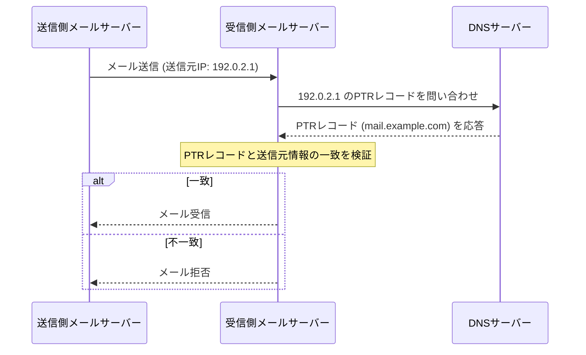

DNSレコードタイプは、ドメイン名とIPアドレスなどの情報を関連付けするためのDNSの設定項目です。

レコードタイプは100種類以上存在します。（廃止・新規追加も行われている）  
IANA（Internet Assigned Numbers Authority）が管理されていて、[こちら](https://www.iana.org/assignments/dns-parameters#dns-parameters-4:~:text=%5BRFC6895%5D-,Resource%20Record%20(RR)%20TYPEs,-Expert(s))でレコードタイプの一覧を確認することもできます。

今まで業務の中で触ったことのある代表的なレコードタイプについて書いていきます。

## Aレコード

AレコードのAはAddressの略になります。

ドメイン名（例: example.com）に対応するIPv4アドレス（例: 192.0.2.0）を指定するレコードになります。

上記の例でいうと、ブラウザ等で`example.com`にアクセスすると、DNSの問い合わせを経て`192.0.2.0`に接続されることになります。




## AAAAレコード

AAAAレコードのAはAddressの略で、IPv4アドレスの長さが32ビットであるのに対して、Ipv6アドレスの長さは128ビットでIPv4アドレスの4倍なことからAAAAと4つのAが使われています。

AレコードがIPv4アドレスとドメインを紐づけるのに対して、AAAAレコードはIPv6アドレスとドメインを紐づけるレコードになります。

ちなみに、IPv6は`2001:0db8:0000:0000:0000:0000:0000:0000`のような形式で表されます。

## CNAMEレコード

CNAMEレコードのCNAMEは`Canonical Name`の略になります。

ある特定のドメイン名（エイリアス）を別のドメイン名（正引き先）に紐づけるレコードになります。

例えば、`www.example.com`を`example.com`に紐づける場合、`www.example.com`のCNAMEレコードを`example.com`に設定します。

すると、ブラウザ等で`www.example.com`にアクセスすると、DNSの問い合わせを経て`example.com`のAレコードが参照され、最終的に`example.com`のIPアドレスに接続されることになります。



GitHub Pagesのカスタムドメイン設定でもCNAMEレコードを使用して、独自ドメインをGitHub Pagesのサイトに紐づけています。

`ホスト名: my-knowledge.st-man.com`
`TYPE: CNAME`
`値: st-man-hori.github.io`

VercelやNetlifyなどのホスティングサービスでも、独自ドメインをサービスに紐づける際にはCNAMEレコードを使用します。

## MXレコード

MXレコードのMXは`Mail eXchanger`の略になります。

指定のドメイン宛てのメールをどのメールサーバで受信するかを指定するレコードになります。

例えば`mail.example.com`宛てのメールを受信するメールサーバを指定する場合、`example.com`のMXレコードを`mail.example.com`に設定します。



MXレコードは優先度を指定することができます。（数値が小さいほど優先度が高くなります）

例えば、`example.com`のMXレコードを以下のように設定した場合、`mail1.example.com`が優先的に使用され、`mail1.example.com`が利用できない場合に`mail2.example.com`が使用されます。

```
example.com.  IN  MX  10 mail1.example.com.
example.com.  IN  MX  20 mail2.example.com.
```

## TXTレコード

TXTレコードのTXTは`Text`の略になります。

ドメインに任意のテキスト情報を紐づけることができるものになります。

もともとは「人間が読むためのメモ」を残すためのものとして策定されたものですが、現在はドメインの所有者確認やSPFなどのメール認証情報の設定にも使用されるようになっています。

メモ用途→セキュリティ認証用途に変化したようなイメージです。

認証用途は、主に下記の４つに分類されます。

| 認証技術 | 説明 | 例 |
| --- | --- | --- |
| SPF | 送信元メールサーバーの認証| `v=spf1 include:_spf.example.com ~all` |
| DKIM | メール本文の改ざん検知 | `v=DKIM1; k=rsa; p=公開鍵` |
| DMARC | SPFやDKIMの結果に基づく受信ポリシー | `v=DMARC1; p=none; rua=mailto:dmarc@example.com` |
| 所有権の証明 | サーチコンソールやSSL証明書発行時のドメイン所有者確認 | `google-site-verification=xxxxxxxxxxxxxxxx` |

TODO: SPF,DKIM,DMARCは別途記事にする予定。

## NSレコード

NSレコードのNSは`Name Server`の略になります。

指定のドメインのDNS情報を管理しているDNSサーバを示すレコードになります。

例えば、`example.com`のDNS情報を管理しているDNSサーバが`hoge.ns.cloudflare.com`の場合、`example.com`のNSレコードを`hoge.ns.cloudflare.com`に設定します。
そうすることで、`example.com`に対するDNSの問い合わせは`hoge.ns.cloudflare.com`に転送され、正しいDNS情報が取得されるようになります。



## PTRレコード

PTRレコードのPTRは`Pointer Record`の略になります。

PTRレコードは、IPアドレスから対応するホスト名を逆引きするためのレコードになります。Aレコードの逆の役割を果たすものと考えるとわかりやすいです。

例えば、`192.0.2.0`に対応するホスト名が`example.com`の場合、`192.0.2.0`のPTRレコードを`example.com`に設定します。

```
0.2.0.192.in-addr.arpa.  IN  PTR  example.com.
```

`in-addr.arpa`は、IPv4アドレスの逆引き専用のドメインになります。IPv6の場合は`ip6.arpa`が逆引き専用のドメインになります。

用途はいくつかあるようですが、主にメールサーバーの逆引きに使用されます。これにより、送信元のIPアドレスから正しいホスト名を確認することができ、スパム対策やセキュリティ強化に役立ちます。



## 理解度チェック（AI生成）

以下の4択問題で、DNSレコードタイプの理解度をチェックしてみましょう。答えは折りたたまれているので、クリックして確認してください。

**Q1. AAAAレコードの名前の由来として正しいものはどれか？**
1. Aレコードの4世代後継バージョンだから
2. IPv6アドレスの長さがIPv4アドレスの4倍（128ビット）だから
3. 4つのDNSサーバーで冗長化されているから
4. 特に意味はなく、慣習的にAAAAと呼ばれている

> [!success]- 答えを見る
> **正解: 2. IPv6アドレスの長さがIPv4アドレスの4倍（128ビット）だから**
> IPv4アドレスが32ビットであるのに対し、IPv6アドレスは128ビットとその4倍の長さがあることから、Aを4つ並べてAAAAレコードと呼ばれています。

**Q2. CNAMEレコードの説明として正しいものはどれか？**
1. ドメインをIPv4アドレスに直接紐づけるレコード
2. あるドメイン名（エイリアス）を別のドメイン名に紐づけるレコード
3. メールの送信元サーバーを認証するためのレコード
4. IPアドレスからホスト名を逆引きするためのレコード

> [!success]- 答えを見る
> **正解: 2. あるドメイン名（エイリアス）を別のドメイン名に紐づけるレコード**
> 例えば`www.example.com`のCNAMEレコードを`example.com`に設定すると、`www.example.com`へのアクセスは`example.com`のAレコードを経由して名前解決されます。

**Q3. MXレコードにおいて、優先度の数値と優先順位の関係として正しいものはどれか？**
1. 数値が大きいほど優先度が高い
2. 数値が小さいほど優先度が高い
3. 優先度はすべて同一で数値に意味はない
4. 優先度はアルファベット順で決まる

> [!success]- 答えを見る
> **正解: 2. 数値が小さいほど優先度が高い**
> MXレコードでは数値が小さいほど優先度が高くなり、そのメールサーバーが利用できない場合に次の優先度のサーバーが使用されます。

**Q4. TXTレコードの用途として<u>誤っている</u>ものはどれか？**
1. SPFによる送信元メールサーバーの認証情報の設定
2. サーチコンソールなどでのドメイン所有者確認
3. ドメインに対応するホスト名の逆引き
4. DKIMによるメール本文の改ざん検知情報の設定

> [!success]- 答えを見る
> **正解: 3. ドメインに対応するホスト名の逆引き**
> IPアドレスからホスト名を逆引きするのはPTRレコードの役割であり、TXTレコードの用途ではありません。TXTレコードはSPF/DKIM/DMARCなどの認証情報や所有権証明などに使われます。

**Q5. NSレコードの役割として正しいものはどれか？**
1. ドメインに対応するIPv4アドレスを指定する
2. 指定のドメインのDNS情報を管理しているDNSサーバーを示す
3. メールの受信サーバーを指定する
4. IPアドレスからホスト名を逆引きする

> [!success]- 答えを見る
> **正解: 2. 指定のドメインのDNS情報を管理しているDNSサーバーを示す**
> NSレコード（Name Server）は、そのドメインのDNS情報を管理しているDNSサーバーを示すレコードです。これにより、問い合わせが正しいDNSサーバーに転送されます。

