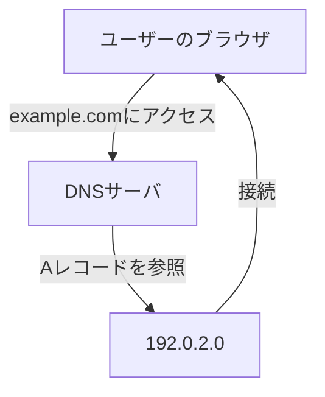

# DNSレコードタイプ

DNSレコードタイプは、ドメイン名とIPアドレスなどの情報を関連付けするためのDNSの設定項目です。

レコードタイプは100種類以上存在します。（廃止・新規追加も行われている）  
IANA（Internet Assigned Numbers Authority）が管理されていて、[こちら](https://www.iana.org/assignments/dns-parameters#dns-parameters-4:~:text=%5BRFC6895%5D-,Resource%20Record%20(RR)%20TYPEs,-Expert(s))でレコードタイプの一覧を確認することもできます。

今まで業務の中で触ったことのある代表的なレコードタイプについて書いていきます。

## Aレコード

ドメイン名（例: example.com）に対応するIPv4アドレス（例: 192.0.2.0）を指定するレコードになります。

上記の例でいうと、ブラウザ等で`example.com`にアクセスすると、DNSの問い合わせを経て`192.0.2.0`に接続されることになります。

