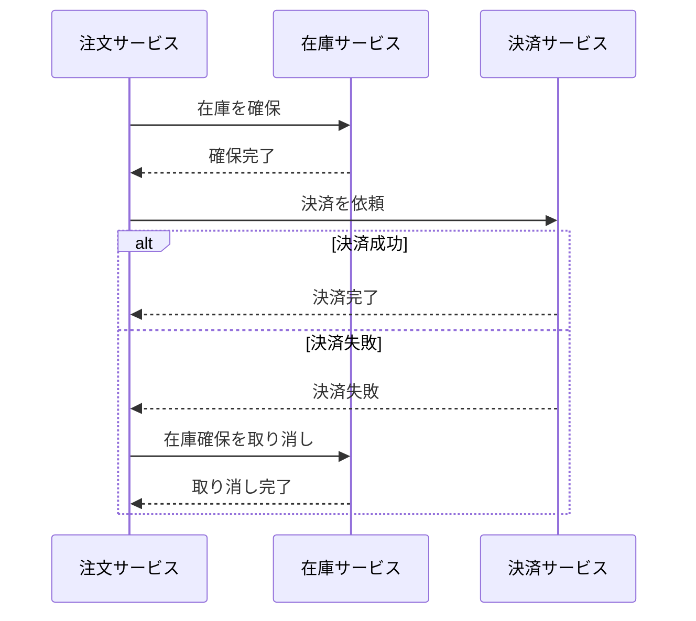

モノリス、マイクロサービスやモジュラーモノリスなどソフトウェアアーキテクチャはなんとなくでは理解しつつもちゃんと整理できていないので、それぞれの特徴やメリット・デメリットを整理し、どのような場合にどのアーキテクチャを選ぶべきかをまとめます。

## モノリスとは

モノリスは「一枚岩」や「単一の塊」といった意味を持ち、ソフトウェア開発上では機能やコンポーネントが単一のコードベースにまとめられているアーキテクチャを指します。


### メリット

- 開発やデプロイが比較的容易である
- 単一のコードベースのため、コードの理解がしやすい
- テストやデバッグが容易である
- トランザクション管理が容易である
などが挙げられます。

小規模なプロジェクトはモノリスが適していることが多いです。

### デメリット

- スケーリングが難しい
- 大規模開発では変更の影響範囲が広くなる
- デプロイの頻度が高い場合は運用が複雑になる
などが挙げられます。

ちょっとした改修でどこに影響が及ぶのか分からない/時間がかかるような状態になっているとモノリスの限界に達していると言えます。

ここまでのモノリスの特徴・メリデメは整理すると以下の図のようになります。


## マイクロサービスとは

マイクロサービスは、ソフトウェアを複数の小さなサービスに分割し、それぞれが独立して開発・デプロイされるアーキテクチャです。各サービスは特定のビジネス機能に責任を持ち、サービス間はAPIなどを通じて通信します。

### メリット

- サービスごとに独立して開発・デプロイが可能である
- スケーリングが柔軟である
- 技術スタックをサービスごとに選択できる
- 障害の影響範囲が限定される
などが挙げられます。

例えば、決済チーム、在庫管理チーム、ユーザ管理チームのように開発チームをサービスごとに分けることができ、独立して作業が進められるようになります。

### デメリット

- サービス間の通信やデータの整合性の管理が複雑である
- 開発チーム間の調整が必要になる
- デプロイや運用の自動化が必須となる
などが挙げられます。

トランザクション管理が複雑になることもあります。

ここまでのマイクロサービスの特徴・メリット・デメリットは整理すると以下の図のようになります。


## Laravelでのモノリスとマイクロサービス

Laravelはもともとモノリス向けに設計されたフレームワークですが、サービス指向アーキテクチャやマイクロサービス的な設計も可能です。例えば、モジュラーモノリスとしてアプリケーションをモジュールごとに分割したり、APIを介して他のサービスと連携することでマイクロサービス的な構成を取ることもできます。

ECサイトで「注文を受けたら在庫を減らして決済する」処理を例に、書き方がどう変わるかを見てみます。

### モノリスの例

在庫も決済も同じアプリケーション・同じDBにあるので、モデルを直接操作するだけで処理できます。

```php
// app/Http/Controllers/OrderController.php
class OrderController extends Controller
{
    public function store(Request $request)
    {
        $product = Product::findOrFail($request->product_id);
        $quantity = $request->quantity;

        // 在庫・決済・注文を1つのトランザクションでまとめて処理
        DB::transaction(function () use ($request, $product, $quantity) {
            // 在庫を減らす
            $product->decrement('stock', $quantity);

            // 決済を記録する
            Payment::create([
                'user_id' => $request->user()->id,
                'amount' => $product->price * $quantity,
            ]);

            // 注文を作成する
            Order::create([
                'user_id' => $request->user()->id,
                'product_id' => $product->id,
                'quantity' => $quantity,
            ]);
        });
        // 途中で例外が出たら、在庫の減算も決済の記録もまとめてロールバックされる

        return redirect()->route('orders.index');
    }
}
```

決済で失敗すれば在庫の減算も自動で取り消されます。なので「お金は払っていないのに在庫だけ減った」という状態にはなりません。

### マイクロサービスの例

在庫と決済は別のサービスで、それぞれ自分のDBを持っています。そのため、HTTPで他のサービスのAPIを呼び出すことになります。

```php
// app/Http/Controllers/OrderController.php（注文サービス）
class OrderController extends Controller
{
    public function store(Request $request)
    {
        $productId = $request->product_id;
        $quantity = $request->quantity;

        // 在庫サービスに在庫の確保を依頼
        $reservation = Http::post('http://inventory-service/api/reservations', [
            'product_id' => $productId,
            'quantity' => $quantity,
        ])->throw()->json();

        // 決済サービスに決済を依頼
        $payment = Http::post('http://payment-service/api/payments', [
            'user_id' => $request->user()->id,
            'product_id' => $productId,
            'quantity' => $quantity,
        ]);

        if ($payment->failed()) {
            // 決済に失敗したら、在庫サービスに「確保を取り消して」と依頼する（補償処理）
            Http::delete("http://inventory-service/api/reservations/{$reservation['id']}");

            return back()->withErrors('決済に失敗しました');
        }

        // 注文は注文サービス自身のDBに保存
        Order::create([
            'user_id' => $request->user()->id,
            'product_id' => $productId,
            'quantity' => $quantity,
        ]);

        return redirect()->route('orders.index');
    }
}
```

サービスをまたぐと `DB::transaction` で囲えないため、失敗したときの取り消し処理（補償処理）を自分で書く必要があります。さらに次のようなケースも考えなければいけません。

- 取り消しのリクエスト自体が失敗したらどうするか
- 決済サービスがタイムアウトしたとき、決済が成功したのか失敗したのか分からない

このようにサービス間の整合性を保つ仕組みは「Sagaパターン」と呼ばれます。マイクロサービスで「トランザクション管理が複雑になる」というのは、こういうことです。

### Sagaパターン

Sagaパターンとは、サービス間の分散トランザクションを管理するための設計パターンです。各サービスが独立してトランザクションを実行し、失敗した場合には補償処理を行うことで整合性を保ちます。

例えば、在庫サービスと決済サービスがある場合、注文サービスはまず在庫を確保し、次に決済を行います。どちらかが失敗した場合には、成功した方の処理を補償することで整合性を保ちます。これにより、分散環境でも一貫性のある状態を維持することができます。

いまいちピンとこないかもしれませんが、要するに「サービス間の処理を順番に実行し、失敗した場合にはそれまでの処理を取り消す」という考え方です。モノリスのように一つのDBでトランザクションを管理できない場合に有効なパターンです。

マーメイドでSagaパターンのフローを図示すると、以下のようになります。



ここで気づいたのはSagaパターンであっても、補償処理自体が失敗する可能性があるということです。そのため、実際の運用ではリトライや監視などの仕組みを組み合わせて、最終的に整合性が保たれるように設計する必要があります。  
具体的にはキューを使って補償処理を非同期で実行したり、エクスポネンシャルバックオフのようなリトライの仕組みを組み込むことで、最終的に整合性を保つ設計が考えられます。

ちなみにエクスポネンシャルバックオフは、以前記事にしています。
[エクスポネンシャルバックオフについての記事](https://my-knowledge.st-man.com/tech/api/exponential-backoff)

## モジュラーモノリスとは

ここまでモノリスとマイクロサービスについて説明してきましたが、かなり両極端なアーキテクチャです。モノリスは開発や運用が比較的簡単ですが、スケーラビリティや柔軟性に欠けます。一方、マイクロサービスはスケーラビリティや柔軟性に優れますが、サービス間の整合性や運用の複雑さが増します。

そこでちょうど中間的に位置するのが「モジュラーモノリス」です。

モジュラーモノリスとは、単一のアプリケーションとしてデプロイされるモノリスでありながら、内部をモジュールごとに分割して設計するアーキテクチャです。これにより、モノリスの開発や運用の容易さを保ちつつ、モジュール間の依存関係を明確にして柔軟性を高めることができます。

### モジュラーモノリスのメリット

- 開発や運用が比較的容易
- モジュール間の依存関係が明確
- 柔軟性が高く、将来的にマイクロサービスへの移行も容易
- 単一のデプロイで済むため、運用コストが低い

### モジュラーモノリスのデメリット

- モジュール間の依存関係が複雑になると、結局モノリスの問題を抱えることになる
- 大規模な変更が必要な場合、単一のデプロイがボトルネックになることがある
- マイクロサービスほどのスケーラビリティは期待できない

特徴・メリット・デメリットを図にまとめると、以下のようになります。


### Laravelでのモジュラーモノリスの例

モノリス・マイクロサービスと同じく「注文を受けたら在庫を減らして決済する」処理を、モジュラーモノリスで書いてみます。

まずはディレクトリをモジュールごとに分けます。各モジュールには「外から呼んでいいクラス（公開API）」を用意し、それ以外は他のモジュールから触らないルールにします。

```
app/
└── Modules/
    ├── Order/
    │   ├── Http/Controllers/OrderController.php
    │   └── Models/Order.php
    ├── Inventory/
    │   ├── InventoryService.php   ← 公開API（外から呼んでいいのはこれだけ）
    │   └── Models/Product.php     ← 内部（他モジュールからは触らない）
    └── Payment/
        ├── PaymentService.php     ← 公開API
        └── Models/Payment.php     ← 内部
```

在庫モジュールの公開APIは次のようになります。

```php
// app/Modules/Inventory/InventoryService.php
class InventoryService
{
    public function priceOf(int $productId): int
    {
        return Product::findOrFail($productId)->price;
    }

    public function decrease(int $productId, int $quantity): void
    {
        Product::findOrFail($productId)->decrement('stock', $quantity);
    }
}
```

注文モジュールからは、この公開APIを通して在庫・決済を操作します。

```php
// app/Modules/Order/Http/Controllers/OrderController.php
class OrderController extends Controller
{
    public function __construct(
        private InventoryService $inventory,
        private PaymentService $payment,
    ) {}

    public function store(Request $request)
    {
        $productId = $request->product_id;
        $quantity = $request->quantity;

        // DBは1つなので、モノリスと同じくトランザクションでまとめられる
        DB::transaction(function () use ($request, $productId, $quantity) {
            // ✕ Product::find($productId)->decrement('stock', $quantity);
            //   在庫モジュールの内部（モデル）を直接触るのはNG

            // ◯ 在庫モジュールの公開APIを呼ぶ
            $price = $this->inventory->priceOf($productId);
            $this->inventory->decrease($productId, $quantity);

            // ◯ 決済モジュールの公開APIを呼ぶ
            $this->payment->charge($request->user()->id, $price * $quantity);

            // 注文は自分のモジュールのモデルなので直接操作してOK
            Order::create([
                'user_id' => $request->user()->id,
                'product_id' => $productId,
                'quantity' => $quantity,
            ]);
        });

        return redirect()->route('orders.index');
    }
}
```

モノリスの例との違いは、`Product` を直接触らず `InventoryService` を経由している点だけです。それでも `DB::transaction` はそのまま使えるので、補償処理（Sagaパターン）は必要ありません。

また、在庫の処理が `InventoryService` に集まっているので、将来在庫をマイクロサービスとして切り出すときも、`InventoryService` の中身をHTTP通信に置き換えればよい形になっています。（その時点でトランザクションは使えなくなるので、Sagaパターンなどの対応は必要になります。）

ただし、Laravel自体には「他モジュールの内部を触ってはいけない」という制約はありません。ルールが守られているかは、Pestのアーキテクチャテストなどでチェックするのがおすすめです。

```php
// tests/Arch/ModuleBoundaryTest.php
arch('注文モジュールは在庫モジュールのモデルを直接使わない')
    ->expect('App\Modules\Order')
    ->not->toUse('App\Modules\Inventory\Models');
```

### MVC+S（サービス層）との違い(AIによる解説)

ここまでのコードを見ると、「Controller・Service・Modelに分けるMVC+Sと何が違うの？」と思うかもしれません。

ざっくり言うと、MVC+Sは「技術的な役割」で横に分ける考え方で、モジュラーモノリスは「業務の機能」で縦に分ける考え方です。

```
MVC+S（役割で横に分ける）          モジュラーモノリス（機能で縦に分ける）
app/                               app/Modules/
├── Http/Controllers/              ├── Order/
│   ├── OrderController.php        │   ├── Controllers/
│   └── ProductController.php      │   ├── Services/
├── Services/                      │   └── Models/
│   ├── InventoryService.php       ├── Inventory/
│   └── PaymentService.php         │   ├── Controllers/
└── Models/                        │   ├── Services/
    ├── Order.php                  │   └── Models/
    ├── Product.php                └── Payment/
    └── Payment.php                    └── ...
```

右側の各モジュールの中身はMVC+Sになっています。つまり両者は対立するものではなく、「機能ごとに区切った箱の中で、それぞれMVC+Sをやる」という関係です。

コードの見た目はほとんど同じで、本当の違いは「誰が何を触っていいか」というルールにあります。

観点 | MVC+S | モジュラーモノリス
---|---|---
`Product` モデル | どこから使ってもいい | 在庫モジュールの中からしか使えない
テーブル | みんなの共有物 | モジュールごとに持ち主がいる
Serviceを作る目的 | 処理の再利用・Controllerを薄くするため | モジュールの窓口（公開API）にするため
ルールの強制 | 特にしない | アーキテクチャテストなどでチェックする

MVC+Sでは、`OrderService` が `Product::where(...)` を直接書いてもルール違反ではありません。これが積み重なると `products` テーブルをあちこちから触る状態になり、在庫だけを切り出そうとしても切り出せなくなります。

モジュラーモノリスでは、これを規約とテストで防ぎます。PHP（Laravel）には「このクラスは同じモジュール内からしか使えない」と言語レベルで制限する仕組みがないため、次のような方法を組み合わせるのが一般的です。

- チームの規約として「他モジュールは公開APIのクラスだけ使う」と決める
- Pestのアーキテクチャテストやdeptracなどの静的解析で、規約違反をCIで検出する
- コードレビューでモジュールをまたぐ依存をチェックする

まとめると、MVC+Sは「1つのモノリスの中をきれいに書く工夫」で、モジュラーモノリスは「モノリスの中にマイクロサービスのような境界を作り、それを規約とテストで守る工夫」と言えます。


## どちらを選ぶべきか

モノリス、マイクロサービス、モジュラーモノリスのどれを選ぶべきかは、プロジェクトの規模やチームの体制、将来的な拡張性の要件などによって変わります。

- 小規模なプロジェクトや開発チームが少ない場合は、モノリスが適していることが多いです。
- サービスごとに独立してスケールさせたい場合や、チームが大規模で分散している場合は、マイクロサービスが適しています。
- モノリスの開発や運用の容易さを保ちつつ、将来的にマイクロサービスへの移行も視野に入れたい場合は、モジュラーモノリスが有効だと考えられます。

## 理解度チェック（AI生成）

以下の4択問題で、モノリス・マイクロサービス・モジュラーモノリスの理解度をチェックしてみましょう。答えは折りたたまれているので、クリックして確認してください。

**Q1. モノリスの説明として最も適切なものはどれか？**
1. 機能ごとに小さなサービスへ分割し、それぞれ独立してデプロイするアーキテクチャ
2. 機能やコンポーネントが単一のコードベースにまとめられ、1つのアプリケーションとしてデプロイされるアーキテクチャ
3. サーバーを持たず、関数単位で実行されるアーキテクチャ
4. フロントエンドとバックエンドを必ず別リポジトリで管理するアーキテクチャ

> [!success]- 答えを見る
> **正解: 2. 機能やコンポーネントが単一のコードベースにまとめられ、1つのアプリケーションとしてデプロイされるアーキテクチャ**
> モノリスは「一枚岩」という意味の通り、すべての機能が1つの塊になっています。1はマイクロサービスの説明です。

**Q2. ECサイトでセール中に決済処理だけ負荷が急増した。マイクロサービスであれば取れる対応として最も適切なものはどれか？**
1. アプリケーション全体のサーバー台数を増やすしかない
2. 決済サービスだけ台数を増やしてスケールさせる
3. 全サービスを1つにまとめ直してから対応する
4. DBを1つに統合してトランザクションで処理する

> [!success]- 答えを見る
> **正解: 2. 決済サービスだけ台数を増やしてスケールさせる**
> マイクロサービスはサービスごとに独立しているため、負荷の高いサービスだけを個別にスケールできます。1はモノリスの場合の対応で、一部だけをスケールできないのがモノリスのデメリットです。

**Q3. モノリスでは `DB::transaction` で在庫の減算と決済をまとめてロールバックできるのに、マイクロサービスではそれができない理由として最も適切なものはどれか？**
1. マイクロサービスではLaravelが使えないから
2. 在庫サービスと決済サービスがそれぞれ別のDBを持ち、ネットワーク越しに通信しているから
3. マイクロサービスではDBを使わないから
4. HTTP通信は必ず成功するのでロールバックが不要だから

> [!success]- 答えを見る
> **正解: 2. 在庫サービスと決済サービスがそれぞれ別のDBを持ち、ネットワーク越しに通信しているから**
> 1つのDBトランザクションで囲えるのは同じDB内の処理だけです。サービスをまたぐ処理では、失敗時の取り消し（補償処理）を自分で実装する必要があります。

**Q4. Sagaパターンの説明として最も適切なものはどれか？**
1. すべてのサービスのDBを1つにまとめて整合性を保つパターン
2. 各サービスの処理を順番に実行し、途中で失敗したらそれまでに成功した処理を補償処理で取り消して整合性を保つパターン
3. サービス間の通信をすべて同期処理に統一するパターン
4. 失敗した処理を無視して先に進めるパターン

> [!success]- 答えを見る
> **正解: 2. 各サービスの処理を順番に実行し、途中で失敗したらそれまでに成功した処理を補償処理で取り消して整合性を保つパターン**
> 例えば「在庫を確保 → 決済」の流れで決済が失敗したら、在庫サービスに確保の取り消しを依頼します。

**Q5. Sagaパターンで、決済失敗後の「在庫確保の取り消し」自体が失敗した場合の対策として最も適切なものはどれか？**
1. 何もしない（いずれ誰かが気づく）
2. 注文サービスを再起動する
3. キューを使って補償処理を非同期で実行し、エクスポネンシャルバックオフなどでリトライする
4. 決済サービスに決済をもう一度依頼する

> [!success]- 答えを見る
> **正解: 3. キューを使って補償処理を非同期で実行し、エクスポネンシャルバックオフなどでリトライする**
> 補償処理も失敗する可能性があるため、リトライや監視の仕組みを組み合わせて、最終的に整合性が保たれるように設計します。

**Q6. モジュラーモノリスの説明として最も適切なものはどれか？**
1. モジュールごとに別々のサーバーへデプロイするアーキテクチャ
2. 単一のアプリケーションとしてデプロイしつつ、内部をモジュールごとに分割し、依存関係を明確にしたアーキテクチャ
3. モノリスとマイクロサービスを同じシステム内で無秩序に混在させたアーキテクチャ
4. モジュール同士が互いの内部のテーブルやクラスを自由に参照できるアーキテクチャ

> [!success]- 答えを見る
> **正解: 2. 単一のアプリケーションとしてデプロイしつつ、内部をモジュールごとに分割し、依存関係を明確にしたアーキテクチャ**
> デプロイや運用はモノリスと同じくシンプルなまま、モジュール間の境界を明確にします。境界がはっきりしているため、将来的にマイクロサービスとして切り出しやすいのも特徴です。4のように他モジュールの内部に直接依存すると、結局モノリスと同じ問題を抱えることになります。

