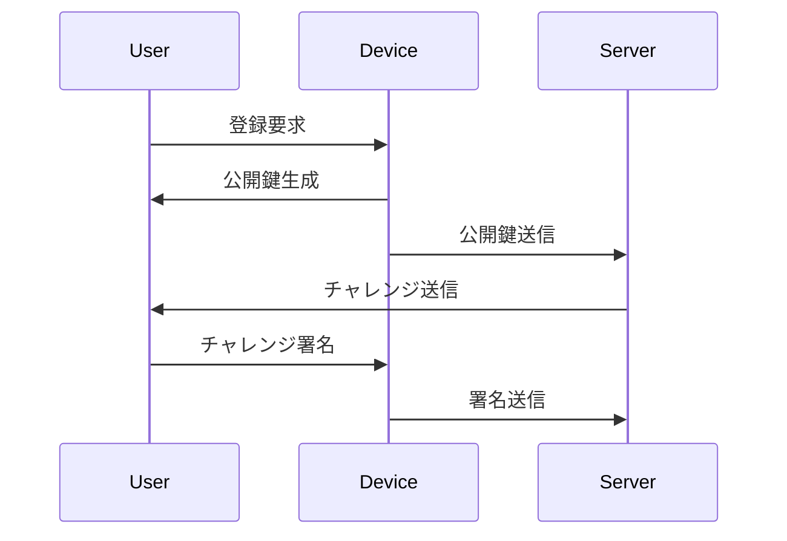

# PassKey(パスキー)とは

パスキーはパスワードに代わる新しい認証方法です。パスワードよりも安全且つ簡単に認証を行うことができます。

生体認証やPIN（暗証番号）を使用してデバイス上で認証を行います。サーバー側には秘密情報が送信されないので、セキュリティリスクが低減されます。

## 背景

パスワードを狙うサイバー攻撃が増加していることを受けて、FIDOやW3Cが国際的な標準規格「FIDO2」を策定して、GoogleやAppleがパスキー対応を行ったという背景があります。

パスワードを狙うサイバー攻撃は具体的に下記のようなことを指します。

- フィッシング詐欺
本物に似ているサイトに誘導されてパスワードを入力してしまうとどんなに強固なパスワードでも意味をなさない
- サーバー攻撃
データベース等が攻撃を受けてパスワードが外部へ漏洩してしまう

## 仕組み

流れとしてはざっくり下記のようになります。

1. ユーザーがウェブサイトやアプリでパスキーを使用して登録を行う。
2. デバイス上で公開鍵と秘密鍵のペアが生成される。秘密鍵はデバイスから出ることはない。（外部からアクセス不可）
3. 公開鍵がサーバーに送信され、ユーザーのアカウントに紐付けられる。（公開鍵はDB等に保存）
4. ログイン時、サーバーはユーザーに対してチャレンジを送信する。
5. デバイス上で秘密鍵を使ってチャレンジに署名し、サーバーに返送する。
6. サーバーは公開鍵で署名を検証し、認証を完了する。

秘密鍵はクラウド経由で安全に共有されるとのことで、複数デバイス間で同期が可能となっています。

図にもしておきます。

イラストにもしておきました（AI生成）

## 懸念

一見いいこと尽くしのように思えますが、下記のような懸念点もあると思っています。

- アカウント復旧が難しい
デバイスを失くしてしまったり、壊してしまったりした場合にアカウントを復旧するのが難しい問題があります。
- レガシーシステム
古いシステムではパスキーに対応していない場合があり、移行が難しいことがあります。
リバースプロキシを挟んでパスキー対応を行う方法もあるようですが、システムが複雑化する可能性があると思います。

## まとめ

パスキーはパスワードに代わる安全で便利な認証方法ですが、アカウント復旧の難しさやレガシーシステムとの互換性などの懸念点もあります。導入にあたってはこれらの点を考慮する必要があります。

LINEヤフーは2027年に従来のパスワード方式の認証を廃止してパスキーに一本化させる予定があるなど、知名度のあるサービス・企業がパスキー対応を進めているので、いずれは認証のデファクトスタンダードになるのではないかと思っています。

## 理解度チェック（AI生成）

以下の4択問題で、パスキーの理解度をチェックしてみましょう。答えは折りたたまれているので、クリックして確認してください。

**Q1. パスキーの認証方法として正しいものはどれか？**
1. サーバーに保存されたパスワードとの一致を確認する
2. 生体認証やPINを使ってデバイス上で認証を行う
3. SMSで送られてくるワンタイムコードを入力する
4. メールアドレスとパスワードの組み合わせで認証する

> [!success]- 答えを見る
> **正解: 2. 生体認証やPINを使ってデバイス上で認証を行う**
> パスキーは生体認証やPINを使ってデバイス上で認証を行い、サーバー側には秘密情報を送信しない仕組みです。

**Q2. パスキーが普及する根本的な背景として本文で挙げられているものはどれか？**
1. パスワードの文字数制限が厳しくなり、ユーザーが不便を感じるようになったため
2. フィッシング詐欺やサーバー攻撃など、パスワードを狙うサイバー攻撃が増加したため
3. FIDOやW3Cが「FIDO2」を策定したこと自体が普及の出発点であったため
4. ブラウザがパスワードの保存に対応しなくなったため

> [!success]- 答えを見る
> **正解: 2. フィッシング詐欺やサーバー攻撃など、パスワードを狙うサイバー攻撃が増加したため**
> パスワードを狙うサイバー攻撃の増加によりパスワードだけでは安全性を担保できなくなったことが根本の背景で、それを受けてFIDOやW3Cが「FIDO2」を策定し、GoogleやAppleが対応を進めたという流れになっています。

**Q3. パスキーの仕組みに関する説明として正しいものはどれか？**
1. 秘密鍵はサーバーに送信され、DB等に保存される
2. 公開鍵はデバイスから出ることがなく、外部からアクセスできない
3. 公開鍵がサーバーに送信され、ユーザーのアカウントに紐付けられる
4. サーバーはユーザーの秘密鍵を使ってチャレンジに署名する

> [!success]- 答えを見る
> **正解: 3. 公開鍵がサーバーに送信され、ユーザーのアカウントに紐付けられる**
> デバイス上で生成された公開鍵と秘密鍵のペアのうち、公開鍵のみがサーバーに送信されアカウントに紐付けられます。秘密鍵はデバイスから出ることはありません。

**Q4. パスキーの懸念点として本文で挙げられているものはどれか？**
1. パスワードよりも入力に時間がかかること
2. デバイスを紛失した場合のアカウント復旧が難しいこと
3. すべてのブラウザで利用できないこと
4. 生体情報がサーバーに保存されてしまうこと

> [!success]- 答えを見る
> **正解: 2. デバイスを紛失した場合のアカウント復旧が難しいこと**
> デバイスを失くしたり壊したりした場合のアカウント復旧の難しさや、パスキーに対応していないレガシーシステムとの互換性が懸念点として挙げられています。